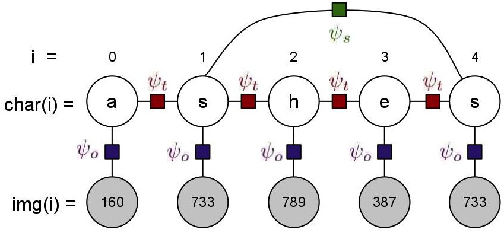

# Optical Word Recognition

We will be studying the computer vision task of recognizing words from images. The task of recognizing words is usually decomposed to recognition of individual characters from their respective images (optical character recognition, OCR), and hence inferring the word. However character recognition is often a very difficult task, and since each character is predicted independent of its neighbors, its results can often contain combinations of characters that may not be possible in English. In this homework we will augment a simple OCR model with additional factors that capture some intuitions based on character co-occurences and image similarities.

The undirected graphical model for recognition of a given word is given in the figure above. It consists of two types of variables:

Image Variables: These are observed images that we need to predict the corresponsing character of, and the number of these image variables for a word is the number of characters in the word. The value of these image variables is an observed image, represented by an integer id (less than 1000). For the description of the model, assume the id of the image at position i is represented by img(i).
Character Variables: These are unobserved variables that represent the character prediction for each of the images, and there is one of these for each of the image variables. For our dataset, the domain of these variables is restricted to the ten most frequent characters in the English language ({e,t,a,o,i,n,s,h,r,d} [[1]](https://en.wikipedia.org/wiki/Letter_frequency#Relative_frequencies_of_letters_in_the_English_language)), instead of the complete alphabet. For the discussion below, assume the predicted character at position i is represented by char(i).

You can download all the data [here](). The archive contains the following files:

* **ocr.dat**: Contains the output predictions of a pre-existing OCR system for the set of thousand images. Each row contains three tab * separated values "id a prob" and represents the OCR system's probability that image id represents character a (P(char=a | img=id) = * prob). Use these values directly as the value of the factor between image and character variables at position i, (image(i)=id, char(i)=a) * = prob. Since there are 10 characters and 1000 images, the total number of rows in this file is 10,000.
* **trans.dat**: Stores the factor potentials for the transition factors. Each row contains three tab-separated values "a b value" that represents the value of factor when the previous character is "a" and the next character is "b", i.e. (char(i)=a, char(i+1)=b) = value. The number of rows in the file is 100 (10*10).
data.dat (and truth.dat): Dataset to run your experiments on (see Core Tasks below). The observed dataset (data.dat) consists observed images of one word on each row. The observed images for a word are represented by a sequence of tab-separated integer ids ("id1 id2 id3"). The true word for these observed set of images is stored the respective row in truth.dat, and is simply a string ("eat"). For the core task (3) below, you should iterate through both the files together to ensure you have the true word along with the observed images.
* Extra files (**bicounts.dat**, **allwords.dat**, **allimagesX.dat**): These files are not necessary for the core tasks, but may be useful for further fun and your own exploration. allwords.dat and allimagesX.dat are larger versions of data.dat and truth.dat, i.e. they contain all possible words that can be generated from our restricted set of alphabet, and five samples of their observed image sequences (one in each file). You can run inference on these if you like, but is likely to take 15-20 times longer than the small dataset. bicount.dat is in the same format as trans.dat, but instead of storing inexplicable potentials, it stores the joint probability of the co-occurences of the characters.

