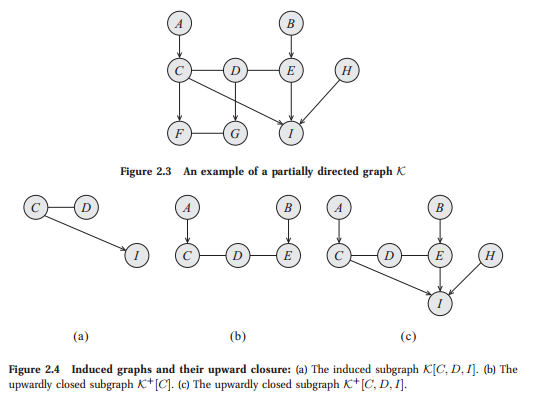
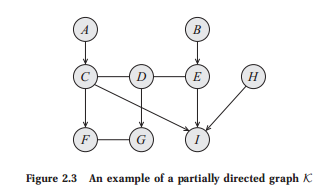
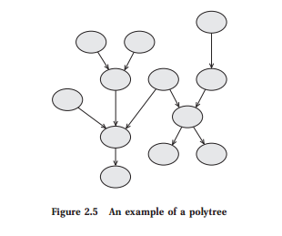

# Foundation: Graph

Perhaps the most pervasive concept in this book is the representation of a probability distribution
using a graph as a data structure. In this section, we survey some of the basic concepts in graph
theory used in the book.

# 1 Nodes and Edges

A graph is a data structure K consisting of a set of nodes and a set of edges. Throughout most
this book, we will assume that the set of nodes is X = {X1,...,Xn}. A pair of nodes Xi,Xj
directed edge can be connected by a directed edge Xi → Xj or an undirected edge Xi—Xj. Thus, the set
undirected edge of edges E is a set of pairs, where each pair is one of Xi → Xj, Xj → Xi, or Xi—Xj, for
Xi,Xj ∈ X , i < j. We assume throughout the book that, for each pair of nodes Xi,Xj, at
most one type of edge exists; thus, we cannot have both Xi → Xj and Xj → Xi, nor can
we have Xi → Xj and Xi—Xj.2 The notation Xi ← Xj is equivalent to Xj → Xi, and the
notation X
j—Xi is equivalent to Xi—Xj. We use Xi
 Xj to represent the case where Xi
and X
j are connected via some edge, whether directed (in any direction) or undirected.
In many cases, we want to restrict attention to graphs that contain only edges of one kind
directed graph or another. We say that a graph is directed if all edges are either Xi → Xj or Xj → Xi. We
usually denote directed graphs as G. We say that a graph is undirected if all edges are Xi—Xj.
undirected graph
We denote undirected graphs as H. We sometimes convert a general graph to an undirected
graph by ignoring the directions on the edges.
Definition 2.11 Given a graph K = (X, E), its undirected version is a graph H = (X, E0) where E0 = {X—Y :
graph’s
undirected
version
X
 Y ∈ E}.
Whenever we have that Xi → Xj ∈ E, we say that Xj is the child of Xi in K, and that
child Xi is the parent of Xj in K. When we have Xi—Xj ∈ E, we say that Xi is a neighbor of
parent
neighbor
Xj
in K (and vice versa). We say that X and Y are adjacent whenever X
 Y ∈ E. We use
PaX to denote the parents of X, ChX to denote its children, and NbX to denote its neighbors.
We define the boundary of X, denoted BoundaryX, to be PaX ∪ NbX; for DAGs, this set is
boundary simply X’s parents, and for undirected graphs X’s neighbors.3 Figure 2.3 shows an example of
a graph K. There, we have that A is the only parent of C, and F,I are the children of C. The
degree only neighbor of C is D, but its adjacent nodes are A,D,F,I. The degree of a node X is the
number of edges in which it participates. Its indegree is the number of directed edges Y → X.
indegree
The degree of a graph is the maximal degree of a node in the graph.
2. Note that our definition is somewhat restricted, in that it disallows cycles of length two, where Xi → Xj → Xi,
and allows self-loops where Xi → Xi.
3. When the graph is not clear from context, we often add the graph as an additional argument.

## 2 Subgraphs

In many cases, we want to consider only the part of the graph that is associated with a particular
subset of the nodes.
Definition 2.12 Let K = (X , E), and let X ⊂ X . We define the induced subgraph K[X] to be the graph (X, E0)
induced
subgraph
where E0 are all the edges X
 Y ∈ E such that X, Y ∈ X.
For example, figure 2.4a shows the induced subgraph K[C, D, I].
A type of subgraph that is often of particular interest is one that contains all possible edges.
Definition 2.13 A subgraph over X is complete if every two nodes in X are connected by some edge. The set X
complete
subgraph
is often called a clique; we say that a clique X is maximal if for any superset of nodes Y ⊃ X,
clique
Y is not a clique.
Although the subset of nodes X can be arbitrary, we are often interested in sets of nodes
that preserve certain aspects of the graph structure.
Definition 2.14 We say that a subset of nodes X ∈ X is upwardly closed in K if, for any X ∈ X, we have that
upward closure BoundaryX ⊂ X. We define the upward closure of X to be the minimal upwardly closed subset

Y that contains X. We define the upwardly closed subgraph of X, denoted K+[X], to be the
induced subgraph over Y , K[Y ].
For example, the set A, B, C, D, E is the upward closure of the set {C} in K. The upwardly
closed subgraph of {C} is shown in figure 2.4b. The upwardly closed subgraph of {C, D, I} is
shown in figure 2.4c.

# 3 Paths and Trails

Using the basic notion of edges, we can define dierent types of longer-range connections in the graph.

**Definition** *path*

*We say that \( X_1, . . . , X_k \) form a path in the graph \( K = (X, E) \)  if, for every \( i = 1, . . . , k − 1 \),
we have that either \( X_i → X_{i+1} \) or \( X_{i} - X_{i+1} \). A path is directed if, for at least one i, we have \( X_{i} → X_{i+1} \).*

**Definition** *trail*

*We say that \( X_1, ... , X_k \) form a trail in the graph \( K = (X, E) \) if, for every \( i = 1, . . . , k − 1 \), we
 have that \( X_i \rightleftharpoons X_{i+1} \).*

In the graph \( K \) of figure 2.3, \(  A, C, D, E, I \) is a path, and hence also a trail. On the other hand, \( A, C, F, G, D \) is a trail, which is not a path.

**Definition** *connected graph*

*A graph* is connected if *for every* \( X_i, X_j \) there is a trail between \( X_i \) and \( X_j \).

We can now define longer-range relationships in the graph.

**Definition** *ancestor*, *descendant*

*We say that \( X \) is an ancestor of \( Y \)* in \( K = (X, E) \), and that *\( Y \) is a descendant of \( X \)*, if there
exists a directed path \( X_1, ..., X_k \) with \( X_1 = X \) and \( X_k = Y \). We use \( Descendants_X \) to denote
*X’s descendants*, \( Ancestors_X \) to denote *X’s ancestors*, and \( NonDescendants_X \) to denote the set of
nodes in \( X − Descendants_X \).

In our example graph K, we have that \( F, G, I \) are descendants of \( C \). The ancestors of \( C \) are \( A \), via the path \( A, C, \) and \( B \), via the path \( B, E, D, C \).

A final useful notion is that of an ordering of the nodes in a directed graph that is consistent with the directionality its edges.

**Definition** *topological ordering*

Let \( G = (X, E) \) be a graph. An ordering of the nodes \( X_1, ... , X_n \) is a topological ordering relative
to \( K \) if, whenever we have \( Xi → Xj ∈ E \), then \( i < j \).

Appendix A.3.1 presents an algorithm for finding such a topological ordering.

## 4 Cycles and Loops
Note that, in general, we can have a cyclic path that leads from a node to itself, making that
node its own descendant.

Definition 2.20 A cycle in K is a directed path X1, . . . , Xk where X1 = Xk. A graph is acyclic if it contains no
cycle
acyclic
cycles.
For most of this book, we will restrict attention to graphs that do not allow such cycles, since it
is quite dicult to define a coherent probabilistic model over graphs with directed cycles.
DAG A directed acyclic graph (DAG) is one of the central concepts in this book, as DAGs are the
basic graphical representation that underlies Bayesian networks. For some of this book, we also
use acyclic graphs that are partially directed. The graph K of figure 2.3 is acyclic. However, if
we add the undirected edge A—E to K, we have a path A, C, D, E, A from A to itself. Clearly,
adding a directed edge E → A would also lead to a cycle. Note that prohibiting cycles does
not imply that there is no trail from a node to itself. For example, K contains several trails:
C, D, E, I, C as well as C, D, G, F, C.
An acyclic graph containing both directed and undirected edges is called a partially directed
PDAG acyclic graph or PDAG. The acyclicity requirement on a PDAG implies that the graph can be
chain component decomposed into a directed graph of chain components, where the nodes within each chain
component are connected to each other only with undirected edges. The acyclicity of a PDAG
guarantees us that we can order the components so that all edges point from lower-numbered
components to higher-numbered ones.
Definition 2.21 Let K be a PDAG over X . Let K1, . . . , K` be a disjoint partition of X such that:
• the induced subgraph over Ki contains no directed edges;
• for any pair of nodes X ∈ Ki and Y ∈ Kj for i < j, an edge between X and Y can only
be a directed edge X → Y .
chain component Each component Ki is called a chain component.
chain graph Because of its chain structure, a PDAG is also called a chain graph.
Example 2.6 In the PDAG of figure 2.3, we have six chain components: {A}, {B}, {C, D, E}, {F, G}, {H},
and {I}. This ordering of the chain components is one of several possible legal orderings.
Note that when the PDAG is an undirected graph, the entire graph forms a single chain
component. Conversely, when the PDAG is a directed graph (and therefore acyclic), each node
in the graph is its own chain component.

Dierent from a cycle is the notion of a loop:
Definition 2.22 A loop in K is a trail X1, . . . , Xk where X1 = Xk. A graph is singly connected if it contains
loop
singly connected
no loops. A node in a singly connected graph is called a leaf if it has exactly one adjacent node.
leaf
A singly connected directed graph is also called a polytree. A singly connected undirected graph is
polytree
called a forest; if it is also connected, it is called a tree.
forest
tree
We can also define a notion of a forest, or of a tree, for directed graphs.
Definition 2.23
A directed graph is a forest if each node has at most one parent. A directed forest is a tree if it is
also connected.
Note that polytrees are very dierent from trees. For example, figure 2.5 shows a graph that is a
polytree but is not a tree, because several nodes have more than one parent. As we will discuss
later in the book, loops in the graph increase the computational cost of various tasks.
We conclude this section with a final definition relating to loops in the graph. This definition
will play an important role in evaluating the cost of reasoning using graph-based representations.
Definition 2.24 Let X1—X2— · · · —Xk—X1 be a loop in the graph; a chord in the loop is an edge connecting
chordal graph Xi and Xj for two nonconsecutive nodes Xi, Xj. An undirected graph H is said to be chordal if
any loop X1—X2— · · · —Xk—X1 for k ≥ 4 has a chord.
Thus, for example, a loop A—B—C—D—A (as in figure 1.1b) is nonchordal, but adding an
edge A—C would render it chordal. In other words, in a chordal graph, the longest “minimal
loop” (one that has no shortcut) is a triangle. Thus, chordal graphs are often also called
triangulated triangulated.
graph We can extend the notion of chordal graphs to graphs that contain directed edges.
Definition 2.25 A graph K is said to be chordal if its underlying undirected graph is chordal.