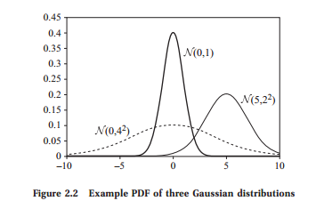

# Foundation: Probability Theory

The main focus of this book is on complex probability distributions. In this section we briefly
review basic concepts from probability theory.

# 1 Probability Distributions

When we use the word “probability” in day-to-day life, we refer to a degree of confidence that
an event of an uncertain nature will occur. For example, the weather report might say “there
is a low probability of light rain in the afternoon.” Probability theory deals with the formal
foundations for discussing such estimates and the rules they should obey.
Before we discuss the representation of probability, we need to define what the events are to
which we want to assign a probability. These events might be dierent outcomes of throwing
a die, the outcome of a horse race, the weather configurations in California, or the possible
failures of a piece of machinery.

## 1.1 Event Spaces
event Formally, we define events by assuming that there is an agreed upon space of possible outcomes,
outcome space which we denote by Ω. For example, if we consider dice, we might set Ω = {1, 2, 3, 4, 5, 6}. In
the case of a horse race, the space might be all possible orders of arrivals at the finish line, a
much larger space.

measurable event In addition, we assume that there is a set of measurable events S to which we are willing to
assign probabilities. Formally, each event α ∈ S is a subset of Ω. In our die example, the event
{6} represents the case where the die shows 6, and the event {1, 3, 5} represents the case of
an odd outcome. In the horse-race example, we might consider the event “Lucky Strike wins,”
which contains all the outcomes in which the horse Lucky Strike is first.
Probability theory requires that the event space satisfy three basic properties:
• It contains the empty event ∅, and the trivial event Ω.
• It is closed under union. That is, if α, β ∈ S, then so is α ∪ β.
• It is closed under complementation. That is, if α ∈ S, then so is Ω − α.
The requirement that the event space is closed under union and complementation implies that
it is also closed under other Boolean operations, such as intersection and set dierence.

## 1.2 Probability Distributions

Definition 2.1 A probability distribution P over (Ω, S) is a mapping from events in S to real values that satisfies
probability
distribution
the following conditions:
• P(α) ≥ 0 for all α ∈ S.
• P(Ω) = 1.
• If α, β ∈ S and α ∩ β = ∅, then P(α ∪ β) = P(α) + P(β).
The first condition states that probabilities are not negative. The second states that the “trivial
event,” which allows all possible outcomes, has the maximal possible probability of 1. The third
condition states that the probability that one of two mutually disjoint events will occur is the
sum of the probabilities of each event. These two conditions imply many other conditions. Of
particular interest are P(∅) = 0, and P(α ∪ β) = P(α) + P(β) − P(α ∩ β).

## 1.3 Interpretations of Probability

Before we continue to discuss probability distributions, we need to consider the interpretations
that we might assign to them. Intuitively, the probability P(α) of an event α quantifies the
degree of confidence that α will occur. If P(α) = 1, we are certain that one of the outcomes
in α occurs, and if P(α) = 0, we consider all of them impossible. Other probability values
represent options that lie between these two extremes.
This description, however, does not provide an answer to what the numbers mean. There are
two common interpretations for probabilities.
frequentist The frequentist interpretation views probabilities as frequencies of events. More precisely, the
interpretation probability of an event is the fraction of times the event occurs if we repeat the experiment
indefinitely. For example, suppose we consider the outcome of a particular die roll. In this case,
the statement P(α) = 0.3, for α = {1, 3, 5}, states that if we repeatedly roll this die and record
the outcome, then the fraction of times the outcomes in α will occur is 0.3. More precisely, the
limit of the sequence of fractions of outcomes in α in the first roll, the first two rolls, the first
three rolls, . . ., the first n rolls, . . . is 0.3.

The frequentist interpretation gives probabilities a tangible semantics. When we discuss
concrete physical systems (for example, dice, coin flips, and card games) we can envision how
these frequencies are defined. It is also relatively straightforward to check that frequencies must
satisfy the requirements of proper distributions.
The frequentist interpretation fails, however, when we consider events such as “It will rain
tomorrow afternoon.” Although the time span of “Tomorrow afternoon” is somewhat ill defined,
we expect it to occur exactly once. It is not clear how we define the frequencies of such events.
Several attempts have been made to define the probability for such an event by finding a
reference class reference class of similar events for which frequencies are well defined; however, none of them
has proved entirely satisfactory. Thus, the frequentist approach does not provide a satisfactory
interpretation for a statement such as “the probability of rain tomorrow afternoon is 0.3.”
 An alternative interpretation views probabilities as subjective degrees of belief. Under
subjective
interpretation
this interpretation, the statement P(α) = 0.3 represents a subjective statement about
one’s own degree of belief that the event α will come about. Thus, the statement “the
probability of rain tomorrow afternoon is 50 percent” tells us that in the opinion of the speaker,
the chances of rain and no rain tomorrow afternoon are the same. Although tomorrow afternoon
will occur only once, we can still have uncertainty about its outcome, and represent it using
numbers (that is, probabilities).
This description still does not resolve what exactly it means to hold a particular degree of
belief. What stops a person from stating that the probability that Bush will win the election
is 0.6 and the probability that he will lose is 0.8? The source of the problem is that we need
to explain how subjective degrees of beliefs (something that is internal to each one of us) are
reflected in our actions.
This issue is a major concern in subjective probabilities. One possible way of attributing
degrees of beliefs is by a betting game. Suppose you believe that P(α) = 0.8. Then you would
be willing to place a bet of $1 against $3. To see this, note that with probability 0.8 you gain a
dollar, and with probability 0.2 you lose $3, so on average this bet is a good deal with expected
gain of 20 cents. In fact, you might be even tempted to place a bet of $1 against $4. Under
this bet the average gain is 0, so you should not mind. However, you would not consider it
worthwhile to place a bet $1 against $4 and 10 cents, since that would have negative expected
gain. Thus, by finding which bets you are willing to place, we can assess your degrees of beliefs.
The key point of this mental game is the following. If you hold degrees of belief that do not
satisfy the rule of probability, then by a clever construction we can find a series of bets that
would result in a sure negative outcome for you. Thus, the argument goes, a rational person
must hold degrees of belief that satisfy the rules of probability.1
In the remainder of the book we discuss probabilities, but we usually do not explicitly state
their interpretation. Since both interpretations lead to the same mathematical rules, the technical
definitions hold for both interpretations.

# 2 Basic Concepts in Probability

## 2.1 Conditional Probability

To use a concrete example, suppose we consider a distribution over a population of students
taking a certain course. The space of outcomes is simply the set of all students in the population.
Now, suppose that we want to reason about the students’ intelligence and their final grade. We
can define the event α to denote “all students with grade A,” and the event β to denote “all
students with high intelligence.” Using our distribution, we can consider the probability of these
events, as well as the probability of α ∩ β (the set of intelligent students who got grade A). This,
however, does not directly tell us how to update our beliefs given new evidence. Suppose we
learn that a student has received the grade A; what does that tell us about her intelligence?
This kind of question arises every time we want to use distributions to reason about the real
world. More precisely, after learning that an event α is true, how do we change our probability
conditional about β occurring? The answer is via the notion of conditional probability. Formally, the
probability conditional probability of β given α is defined as
P(β | α) = P(α ∩ β)
P(α) (2.1)
That is, the probability that β is true given that we know α is the relative proportion of outcomes
satisfying β among these that satisfy α. (Note that the conditional probability is not defined
when P(α) = 0.)
The conditional probability given an event (say α) satisfies the properties of definition 2.1 (see
exercise 2.4), and thus it is a probability distribution by its own right. Hence, we can think
of the conditioning operation as taking one distribution and returning another over the same
probability space.

## 2.2 Chain Rule and Bayes Rule

From the definition of the conditional distribution, we immediately see that
P(α ∩ β) = P(α)P(β | α). (2.2)
chain rule This equality is known as the chain rule of conditional probabilities. More generally, if
α1, . . . , αk are events, then we can write
P(α1 ∩ . . . ∩ αk) = P(α1)P(α2 | α1) · · · P(αk | α1 ∩ . . . ∩ αk−1). (2.3)
In other words, we can express the probability of a combination of several events in terms of the
probability of the first, the probability of the second given the first, and so on. It is important
to notice that we can expand this expression using any order of events — the result will remain
the same.
Bayes’ rule Another immediate consequence of the definition of conditional probability is Bayes’ rule
P(α | β) = P(β | α)P(α)
P(β)

A more general conditional version of Bayes’ rule, where all our probabilities are conditioned on
some background event γ, also holds:
P(α | β ∩ γ) = P(β | α ∩ γ)P(α | γ)
P(β | γ) .
Bayes’ rule is important in that it allows us to compute the conditional probability P(α | β)
from the “inverse” conditional probability P(β | α).
Example 2.1 Consider the student population, and let Smart denote smart students and GradeA denote students who got grade A. Assume we believe (perhaps based on estimates from past statistics) that
P(GradeA | Smart) = 0.6, and now we learn that a particular student received grade A. Can
we estimate the probability that the student is smart? According to Bayes’ rule, this depends on
prior our prior probability for students being smart (before we learn anything about them) and the
prior probability of students receiving high grades. For example, suppose that P(Smart) = 0.3
and P(GradeA) = 0.2, then we have that P(Smart | GradeA) = 0.6 ∗ 0.3/0.2 = 0.9. That
is, an A grade strongly suggests that the student is smart. On the other hand, if the test was
easier and high grades were more common, say, P(GradeA) = 0.4 then we would get that
P(Smart | GradeA) = 0.6 ∗ 0.3/0.4 = 0.45, which is much less conclusive about the student.
Another classic example that shows the importance of this reasoning is in disease screening.
To see this, consider the following hypothetical example (none of the mentioned figures are
related to real statistics).
Example 2.2 Suppose that a tuberculosis (TB) skin test is 95 percent accurate. That is, if the patient is TB-infected,
then the test will be positive with probability 0.95, and if the patient is not infected, then the test
will be negative with probability 0.95. Now suppose that a person gets a positive test result. What is
the probability that he is infected? Naive reasoning suggests that if the test result is wrong 5 percent
of the time, then the probability that the subject is infected is 0.95. That is, 95 percent of subjects
with positive results have TB.
If we consider the problem by applying Bayes’ rule, we see that we need to consider the prior
probability of TB infection, and the probability of getting positive test result. Suppose that 1 in
1000 of the subjects who get tested is infected. That is, P(TB) = 0.001. What is the probability of
getting a positive test result? From our description, we see that 0.001 · 0.95 infected subjects get a
positive result, and 0.999·0.05 uninfected subjects get a positive result. Thus, P(Positive) = 0.0509.
Applying Bayes’ rule, we get that P(TB | Positive) = 0.001·0.95/0.0509 ≈ 0.0187. Thus, although
a subject with a positive test is much more probable to be TB-infected than is a random subject,
fewer than 2 percent of these subjects are TB-infected.

# 3 Random Variables and Joint Distributions

## 3.1 Motivation

Our discussion of probability distributions deals with events. Formally, we can consider any
event from the set of measurable events. The description of events is in terms of sets of
outcomes. In many cases, however, it would be more natural to consider attributes of the
outcome. For example, if we consider a patient, we might consider attributes such as “age,”

“gender,” and “smoking history” that are relevant for assigning probability over possible diseases
and symptoms. We would like then consider events such as “age > 55, heavy smoking history,
and suers from repeated cough.”
To use a concrete example, consider again a distribution over a population of students in a
course. Suppose that we want to reason about the intelligence of students, their final grades,
and so forth. We can use an event such as GradeA to denote the subset of students that received
the grade A and use it in our formulation. However, this discussion becomes rather cumbersome
if we also want to consider students with grade B, students with grade C, and so on. Instead, we
would like to consider a way of directly referring to a student’s grade in a clean, mathematical
way.
The formal machinery for discussing attributes and their values in dierent outcomes are
random variable random variables. A random variable is a way of reporting an attribute of the outcome. For
example, suppose we have a random variable Grade that reports the final grade of a student,
then the statement P (Grade = A) is another notation for P (GradeA).

n the statement P (Grade = A) is another notation for P (GradeA).

## 3.2 What Is a Random Variable?

Formally, a random variable, such as Grade, is defined by a function that associates with each
outcome in Ω a value. For example, Grade is defined by a function fGrade that maps each person
in Ω to his or her grade (say, one of A, B, or C). The event Grade = A is a shorthand for
the event {ω ∈ Ω : fGrade(ω) = A}. In our example, we might also have a random variable
Intelligence that (for simplicity) takes as values either “high” or “low.” In this case, the event
“Intelligence = high” refers, as can be expected, to the set of smart (high intelligence) students.
Random variables can take dierent sets of values. We can think of categorical (or discrete)
random variables that take one of a few values, as in our two preceding examples. We can also
talk about random variables that can take infinitely many values (for example, integer or real
values), such as Height that denotes a student’s height. We use Val(X) to denote the set of
values that a random variable X can take.
In most of the discussion in this book we examine either categorical random variables or
random variables that take real values. We will usually use uppercase roman letters X, Y, Z
to denote random variables. In discussing generic random variables, we often use a lowercase
letter to refer to a value of a random variable. Thus, we use x to refer to a generic value of X.
For example, in statements such as “P (X = x) ≥ 0 for all x ∈ Val(X).” When we discuss
categorical random variables, we use the notation x1, . . . , xk, for k = |Val(X)| (the number
of elements in Val(X)), when we need to enumerate the specific values of X, for example, in
statements such as
kX i
=1
P (X = xi) = 1.
multinomial The distribution over such a variable is called a multinomial. In the case of a binary-valued
distribution random variable X, where Val(X) = {false, true}, we often use x1 to denote the value true for
X, and x0 to denote the value false. The distribution of such a random variable is called a
Bernoulli Bernoulli distribution.
distribution We also use boldface type to denote sets of random variables. Thus, X, Y , or Z are typically
used to denote a set of random variables, while x, y, z denote assignments of values to the

variables in these sets. We extend the definition of Val(X) to refer to sets of variables in the
obvious way. Thus, x is always a member of Val(X). For Y ⊆ X, we use xhY i to refer to the
assignment within x to the variables in Y . For two assignments x (to X) and y (to Y ), we say
that x ∼ y if they agree on the variables in their intersection, that is, xhX ∩ Y i = yhX ∩ Y i.
In many cases, the notation P(X = x) is redundant, since the fact that x is a value of X
is already reported by our choice of letter. Thus, in many texts on probability, the identity of a
random variable is not explicitly mentioned, but can be inferred through the notation used for
its value. Thus, we use P(x) as a shorthand for P(X = x) when the identity of the random
variable is clear from the context. Another shorthand notation is that Px refers to a sum
over all possible values that X can take. Thus, the preceding statement will often appear as
Px P(x) = 1. Finally, another standard notation has to do with conjunction. Rather than write
P((X = x) ∩ (Y = y)), we write P(X = x, Y = y), or just P(x, y).

## 3.3 Marginal and Joint Distributions

Once we define a random variable X, we can consider the distribution over events that can be
marginal described using X. This distribution is often referred to as the marginal distribution over the
distribution random variable X. We denote this distribution by P(X).
Returning to our population example, consider the random variable Intelligence. The marginal
distribution over Intelligence assigns probability to specific events such as P(Intelligence = high)
and P(Intelligence = low), as well as to the trivial event P(Intelligence ∈ {high, low}). Note
that these probabilities are defined by the probability distribution over the original space. For
concreteness, suppose that P(Intelligence = high) = 0.3, P(Intelligence = low) = 0.7.
If we consider the random variable Grade, we can also define a marginal distribution. This is a
distribution over all events that can be described in terms of the Grade variable. In our example,
we have that P(Grade = A) = 0.25, P(Grade = B) = 0.37, and P(Grade = C) = 0.38.
It should be fairly obvious that the marginal distribution is a probability distribution satisfying
the properties of definition 2.1. In fact, the only change is that we restrict our attention to the
subsets of S that can be described with the random variable X.
In many situations, we are interested in questions that involve the values of several random
variables. For example, we might be interested in the event “Intelligence = high and Grade = A.”
joint distribution To discuss such events, we need to consider the joint distribution over these two random
variables. In general, the joint distribution over a set X = {X1, . . . , Xn} of random variables
is denoted by P(X1, . . . , Xn) and is the distribution that assigns probabilities to events that
are specified in terms of these random variables. We use ξ to refer to a full assignment to the
variables in X , that is, ξ ∈ Val(X).
The joint distribution of two random variables has to be consistent with the marginal distribution, in that P(x) = P
y P(x, y). This relationship is shown in figure 2.1, where we compute
the marginal distribution over Grade by summing the probabilities along each row. Similarly,
we find the marginal distribution over Intelligence by summing out along each column. The
resulting sums are typically written in the row or column margins, whence the term “marginal
distribution.”
Suppose we have a joint distribution over the variables X = {X1, . . . , Xn}. The most
fine-grained events we can discuss using these variables are ones of the form “X1 = x1 and
X2 = x2, . . ., and Xn = xn” for a choice of values x1, . . . , xn for all the variables. Moreover,

Intelligence
low high
A 0.07 0.18 0.25
Grade B 0.28 0.09 0.37
C 0.35 0.03 0.38
0.7 0.3 1
Figure 2.1 Example of a joint distribution P(Intelligence, Grade): Values of Intelligence (columns) and
Grade (rows) with the associated marginal distribution on each variable.
any two such events must be either identical or disjoint, since they both assign values to all the
variables in X . In addition, any event defined using variables in X must be a union of a set of
canonical such events. Thus, we are eectively working in a canonical outcome space: a space where each
outcome space outcome corresponds to a joint assignment to X1, . . . , Xn. More precisely, all our probability
computations remain the same whether we consider the original outcome space (for example,
all students), or the canonical space (for example, all combinations of intelligence and grade).
atomic outcome We use ξ to denote these atomic outcomes: those assigning a value to each variable in X . For
example, if we let X = {Intelligence, Grade}, there are six atomic outcomes, shown in figure 2.1.
The figure also shows one possible joint distribution over these six outcomes.
Based on this discussion, from now on we will not explicitly specify the set of outcomes and
measurable events, and instead implicitly assume the canonical outcome space.

## 3.4 Conditional Probability

The notion of conditional probability extends to induced distributions over random variables. For
conditional example, we use the notation P (Intelligence | Grade = A) to denote the conditional distribution
distribution over the events describable by Intelligence given the knowledge that the student’s grade is A.
Note that the conditional distribution over a random variable given an observation of the value
of another one is not the same as the marginal distribution. In our example, P (Intelligence =
high) = 0.3, and P (Intelligence = high | Grade = A) = 0.18/0.25 = 0.72. Thus, clearly
P (Intelligence | Grade = A) is dierent from the marginal distribution P (Intelligence). The latter
distribution represents our prior knowledge about students before learning anything else about a
particular student, while the conditional distribution represents our more informed distribution
after learning her grade.
We will often use the notation P (X | Y ) to represent a set of conditional probability
distributions. Intuitively, for each value of Y , this object assigns a probability over values of X
using the conditional probability. This notation allows us to write the shorthand version of the
chain rule: P (X, Y ) = P (X)P (Y | X), which can be extended to multiple variables as
P (X1, . . . , Xk) = P (X1)P (X2 | X1) · · · P (Xk | X1, . . . , Xk−1). (2.5)
Similarly, we can state Bayes’ rule in terms of conditional probability distributions:
P (X | Y ) = P (X)P (Y | X)
P (Y ) . (2.6)

# 4 Independence and Conditional Independence

## 4.1 Independence

As we mentioned, we usually expect P(α | β) to be dierent from P(α). That is, learning that
β is true changes our probability over α. However, in some situations equality can occur, so
that P(α | β) = P(α). That is, learning that β occurs did not change our probability of α.
Definition 2.2 We say that an event α is independent of event β in P , denoted P |= (α ⊥ β), if P(α | β) =
independent
events
P(α) or if P(β) = 0.
We can also provide an alternative definition for the concept of independence:
Proposition 2.1 A distribution P satisfies (α ⊥ β) if and only if P(α ∩ β) = P(α)P(β).
Proof Consider first the case where P(β) = 0; here, we also have P(α ∩ β) = 0, and so
the equivalence immediately holds. When P(β) 6= 0, we can use the chain rule; we write
P(α∩β) = P(α | β)P(β). Since α is independent of β, we have that P(α | β) = P(α). Thus,
P(α ∩ β) = P(α)P(β). Conversely, suppose that P(α ∩ β) = P(α)P(β). Then, by definition,
we have that
P(α | β) = P(α ∩ β)
P(β) =
P(α)P(β)
P(β) = P(α).
As an immediate consequence of this alternative definition, we see that independence is a
symmetric notion. That is, (α ⊥ β) implies (β ⊥ α).
Example 2.3 For example, suppose that we toss two coins, and let α be the event “the first toss results in a head”
and β the event “the second toss results in a head.” It is not hard to convince ourselves that we
expect that these two events to be independent. Learning that β is true would not change our
probability of α. In this case, we see two dierent physical processes (that is, coin tosses) leading
to the events, which makes it intuitive that the probabilities of the two are independent. In certain
cases, the same process can lead to independent events. For example, consider the event α denoting
“the die outcome is even” and the event β denoting “the die outcome is 1 or 2.” It is easy to check
that if the die is fair (each of the six possible outcomes has probability 1 6 ), then these two events are
independent.

## 4.2 Conditional Independence

 While independence is a useful property, it is not often that we encounter two indepen- dent events. A more common situation is when two events are independent given an
additional event. For example, suppose we want to reason about the chance that our student
is accepted to graduate studies at Stanford or MIT. Denote by Stanford the event “admitted to
Stanford” and by MIT the event “admitted to MIT.” In most reasonable distributions, these two
events are not independent. If we learn that a student was admitted to Stanford, then our
estimate of her probability of being accepted at MIT is now higher, since it is a sign that she is
a promising student

Now, suppose that both universities base their decisions only on the student’s grade point
average (GPA), and we know that our student has a GPA of A. In this case, we might argue
that learning that the student was admitted to Stanford should not change the probability that
she will be admitted to MIT: Her GPA already tells us the information relevant to her chances
of admission to MIT, and finding out about her admission to Stanford does not change that.
Formally, the statement is
P(MIT | Stanford, GradeA) = P(MIT | GradeA).
In this case, we say that MIT is conditionally independent of Stanford given GradeA.
Definition 2.3 We say that an event α is conditionally independent of event β given event γ in P, denoted
conditional
independence
P |= (α ⊥ β | γ), if P(α | β ∩ γ) = P(α | γ) or if P(β ∩ γ) = 0.
It is easy to extend the arguments we have seen in the case of (unconditional) independencies
to give an alternative definition.
Proposition 2.2 P satisfies (α ⊥ β | γ) if and only if P(α ∩ β | γ) = P(α | γ)P(β | γ).

## 4.3 Independence of Random Variables

Until now, we have focused on independence between events. Thus, we can say that two events,
such as one toss landing heads and a second also landing heads, are independent. However, we
would like to say that any pair of outcomes of the coin tosses is independent. To capture such
statements, we can examine the generalization of independence to sets of random variables.
Definition 2.4 Let X, Y , Z be sets of random variables. We say that X is conditionally independent of Y given
conditional
independence
Z in a distribution P if P satisfies (X = x ⊥ Y = y | Z = z) for all values x ∈ Val(X),
y ∈ Val(Y ), and z ∈ Val(Z). The variables in the set Z are often said to be observed. If the set
observed variable Z is empty, then instead of writing (X ⊥ Y | ∅), we write (X ⊥ Y ) and say that X and Y
are marginally independent.
marginal
independence
Thus, an independence statement over random variables is a universal quantification over all
possible values of the random variables.
The alternative characterization of conditional independence follows immediately:
Proposition 2.3 The distribution P satisfies (X ⊥ Y | Z) if and only if P(X, Y | Z) = P(X | Z)P(Y | Z).
Suppose we learn about a conditional independence. Can we conclude other independence
properties that must hold in the distribution? We have already seen one such example:
symmetry • Symmetry:
(X ⊥ Y | Z) =⇒ (Y ⊥ X | Z). (2.7)
There are several other properties that hold for conditional independence, and that often
provide a very clean method for proving important properties about distributions. Some key
properties are:

• Decomposition:
(X ⊥ Y , W | Z) =⇒ (X ⊥ Y | Z). (2.8)
weak union • Weak union:
(X ⊥ Y , W | Z) =⇒ (X ⊥ Y | Z, W). (2.9)
contraction • Contraction:
(X ⊥ W | Z, Y )&(X ⊥ Y | Z) =⇒ (X ⊥ Y , W | Z). (2.10)
An additional important property does not hold in general, but it does hold in an important
subclass of distributions.
Definition 2.5 A distribution P is said to be positive if for all events α ∈ S such that α 6= ∅, we have that
positive
distribution
P(α) > 0.
For positive distributions, we also have the following property:
intersection • Intersection: For positive distributions, and for mutually disjoint sets X, Y , Z, W :
(X ⊥ Y | Z, W)&(X ⊥ W | Z, Y ) =⇒ (X ⊥ Y , W | Z). (2.11)
The proof of these properties is not dicult. For example, to prove Decomposition, assume
that (X ⊥ Y, W | Z) holds. Then, from the definition of conditional independence, we have
that P(X, Y, W | Z) = P(X | Z)P(Y, W | Z). Now, using basic rules of probability and
arithmetic, we can show
P(X, Y | Z) = X
w
P(X, Y, w | Z)
= X
w
P(X | Z)P(Y, w | Z)
= P(X | Z) X
w
P(Y, w | Z)
= P(X | Z)P(Y | Z).
The only property we used here is called “reasoning by cases” (see exercise 2.6). We conclude
that (X ⊥ Y | Z).

# 5 Querying a Distribution

Our focus throughout this book is on using a joint probability distribution over multiple random
variables to answer queries of interest.

## 5.1 Probability Queries

probability query Perhaps the most common query type is the probability query. Such a query consists of two
parts:
evidence • The evidence: a subset E of random variables in the model, and an instantiation e to these
variables;
query variables • the query variables: a subset Y of random variables in the network.
Our task is to compute
P(Y | E = e),
posterior that is, the posterior probability distribution over the values y of Y , conditioned on the fact that
distribution E = e. This expression can also be viewed as the marginal over Y , in the distribution we
obtain by conditioning on e.

## 5.2 MAP Queries

A second important type of task is that of finding a high-probability joint assignment to some
subset of variables. The simplest variant of this type of task is the MAP query (also called
MAP assignment most probable explanation (MPE)), whose aim is to find the MAP assignment — the most likely
assignment to all of the (non-evidence) variables. More precisely, if we let W = X − E, our
task is to find the most likely assignment to the variables in W given the evidence E = e:
MAP(W | e) = argmax
w
P(w, e), (2.12)
where, in general, argmaxx f(x) represents the value of x for which f(x) is maximal. Note
that there might be more than one assignment that has the highest posterior probability. In this
case, we can either decide that the MAP task is to return the set of possible assignments, or to
return an arbitrary member of that set.
It is important to understand the dierence between MAP queries and probability queries. In
a MAP query, we are finding the most likely joint assignment to W . To find the most likely
assignment to a single variable A, we could simply compute P(A | e) and then pick the most
likely value. However, the assignment where each variable individually picks its most
 likely value can be quite dierent from the most likely joint assignment to all variables
simultaneously. This phenomenon can occur even in the simplest case, where we have no
evidence.
Example 2.4 Consider a two node chain A → B where A and B are both binary-valued. Assume that:
a0 a1
0.4 0.6
A b0 b1
a0 0.1 0.9
a1 0.5 0.5
(2.13)
We can see that P(a1) > P(a0), so that MAP(A) = a1. However, MAP(A, B) = (a0, b1): Both
values of B have the same probability given a1. Thus, the most likely assignment containing a1 has
probability 0.6 × 0.5 = 0.3. On the other hand, the distribution over values of B is more skewed
given a0, and the most likely assignment (a0, b1) has the probability 0.4 × 0.9 = 0.36. Thus, we
have that argmaxa,b P(a, b) 6= (argmaxa P(a),argmaxb P(b)).

## 5.3 Marginal MAP Queries

To motivate our second query type, let us return to the phenomenon demonstrated in example 2.4. Now, consider a medical diagnosis problem, where the most likely disease has multiple
possible symptoms, each of which occurs with some probability, but not an overwhelming probability. On the other hand, a somewhat rarer disease might have only a few symptoms, each
of which is very likely given the disease. As in our simple example, the MAP assignment to
the data and the symptoms might be higher for the second disease than for the first one. The
solution here is to look for the most likely assignment to the disease variable(s) only, rather than
the most likely assignment to both the disease and symptom variables. This approach suggests
marginal MAP the use of a more general query type. In the marginal MAP query, we have a subset of variables
Y that forms our query. The task is to find the most likely assignment to the variables in Y
given the evidence E = e:
MAP(Y | e) = arg max
y
P(y | e).
If we let Z = X − Y − E, the marginal MAP task is to compute:
MAP(Y | e) = arg max
Y
X Z
P(Y , Z | e).
Thus, marginal MAP queries contain both summations and maximizations; in a way, it contains
elements of both a conditional probability query and a MAP query.
Note that example 2.4 shows that marginal MAP assignments are not monotonic: the most
likely assignment MAP(Y1 | e) might be completely dierent from the assignment to Y1 in
MAP({Y1, Y2} | e). Thus, in particular, we cannot use a MAP query to give us the correct
answer to a marginal MAP query.

# 6 Continuous Spaces

In the previous section, we focused on random variables that have a finite set of possible values.
In many situations, we also want to reason about continuous quantities such as weight, height,
duration, or cost that take real numbers in IR.
When dealing with probabilities over continuous random variables, we have to deal with some
technical issues. For example, suppose that we want to reason about a random variable X that
can take values in the range between 0 and 1. That is, Val(X) is the interval [0, 1]. Moreover,
assume that we want to assign each number in this range equal probability. What would be the
probability of a number x? Clearly, since each x has the same probability, and there are infinite
number of values, we must have that P(X = x) = 0. This problem appears even if we do not
require uniform probability.

## 6.1 Probability Density Functions

How do we define probability over a continuous random variable? We say that a function
density function p : IR 7→ IR is a probability density function or (PDF) for X if it is a nonnegative integrable

function such that
Z
Val(X)
p(x)dx = 1.
That is, the integral over the set of possible values of X is 1. The PDF defines a distribution for
X as follows: for any x in our event space:
P(X ≤ a) =
aZ
−∞
p(x)dx.
cumulative The function P is the cumulative distribution for X. We can easily employ the rules of
distribution probability to see that by using the density function we can evaluate the probability of other
events. For example,
P(a ≤ X ≤ b) =
bZa
p(x)dx.
Intuitively, the value of a PDF p(x) at a point x is the incremental amount that x adds to the
cumulative distribution in the integration process. The higher the value of p at and around x,
the more mass is added to the cumulative distribution as it passes x.
The simplest PDF is the uniform distribution.
Definition 2.6 A variable X has a uniform distribution over [a, b], denoted X ∼ Unif[a,b] if it has the PDF
uniform
distribution
p(x) =  0 otherwise b− 1a b ≥ x ≥ a.
Thus, the probability of any subinterval of [a, b] is proportional its size relative to the size of
[a, b]. Note that, if b − a < 1, then the density can be greater than 1. Although this looks
unintuitive, this situation can occur even in a legal PDF, if the interval over which the value is
greater than 1 is not too large. We have only to satisfy the constraint that the total area under
the PDF is 1.
As a more complex example, consider the Gaussian distribution.
Definition 2.7 A random variable X has a Gaussian distribution with mean µ and variance σ2, denoted X ∼
Gaussian
distribution
N µ; σ2, if it has the PDF
p(x) = √21πσ e− (x2 − σµ 2)2 .
standard A standard Gaussian is one with mean 0 and variance 1.
Gaussian
A Gaussian distribution has a bell-like curve, where the mean parameter µ controls the
location of the peak, that is, the value for which the Gaussian gets its maximum value. The
variance parameter σ2 determines how peaked the Gaussian is: the smaller the variance, the

more peaked the Gaussian. Figure 2.2 shows the probability density function of a few dierent
Gaussian distributions.
More technically, the probability density function is specified as an exponential, where the
expression in the exponent corresponds to the square of the number of standard deviations σ
that x is away from the mean µ. The probability of x decreases exponentially with the square
of its deviation from the mean, as measured in units of its standard deviation.

## 6.2 Joint Density Functions

The discussion of density functions for a single variable naturally extends for joint distributions
of continuous random variables.
Definition 2.8 Let P be a joint distribution over continuous random variables X1, . . . , Xn. A function p(x1, . . . , xn)
joint density is a joint density function of X1, . . . , Xn if
• p(x1, . . . , xn) ≥ 0 for all values x1, . . . , xn of X1, . . . , Xn.
• p is an integrable function.
• For any choice of a1, . . . , an, and b1, . . . , bn,
P(a1 ≤ X1 ≤ b1, . . . , an ≤ Xn ≤ bn) =
b1
Za1
· · ·
b
nZ
a
n
p(x1, . . . , xn)dx1 . . . dxn.
Thus, a joint density specifies the probability of any joint event over the variables of interest.
Both the uniform distribution and the Gaussian distribution have natural extensions to the
multivariate case. The definition of a multivariate uniform distribution is straightforward. We
defer the definition of the multivariate Gaussian to section 7.1.
From the joint density we can derive the marginal density of any random variable by integrating out the other variables. Thus, for example, if p(x, y) is the joint density of X and Y

then
p(x) =
∞ Z
−∞
p(x, y)dy.
To see why this equality holds, note that the event a ≤ X ≤ b is, by definition, equal to the
event “a ≤ X ≤ b and −∞ ≤ Y ≤ ∞.” This rule is the direct analogue of marginalization for
discrete variables. Note that, as with discrete probability distributions, we abuse notation a bit
and use p to denote both the joint density of X and Y and the marginal density of X. In cases
where the distinction is not clear, we use subscripts, so that pX will be the marginal density, of
X, and pX,Y the joint density.

## 6.3 Conditional Density Functions

As with discrete random variables, we want to be able to describe conditional distributions of
continuous variables. Suppose, for example, we want to define P(Y | X = x). Applying the
definition of conditional distribution (equation (2.1)), we run into a problem, since P(X = x) =
0. Thus, the ratio of P(Y, X = x) and P(X = x) is undefined.
To avoid this problem, we might consider conditioning on the event x −  ≤ X ≤ x + ,
which can have a positive probability. Now, the conditional probability is well defined. Thus, we
might consider the limit of this quantity when  → 0. We define
P(Y | x) = lim
→0
P(Y | x −  ≤ X ≤ x + ).
When does this limit exist? If there is a continuous joint density function p(x, y), then we can
derive the form for this term. To do so, consider some event on Y , say a ≤ Y ≤ b. Recall that
P(a ≤ Y ≤ b | x −  ≤ X ≤ x + ) = P(a ≤ Y ≤ b, x −  ≤ X ≤ x + )
P(x −  ≤ X ≤ x + )
=
Ra b Rx x− + p(x0, y)dydx0
Rx x− + p(x0)dx0 .
When  is suciently small, we can approximate
x+
Z
x−
p(x0)dx0 ≈ 2p(x).
Using a similar approximation for p(x0, y), we get
P(a ≤ Y ≤ b | x −  ≤ X ≤ x + ) ≈
Ra b 2p(x, y)dy
2p(x)
=
bZa
p(x, y)
p(x) dy.
We conclude that p(x,y)
p(x) is the density of P(Y | X = x).

Let p(x, y) be the joint density of X and Y . The conditional density function of Y given X is
conditional
density function
defined as
p(y | x) = p(x, y)
p(x)
When p(x) = 0, the conditional density is undefined.
The conditional density p(y | x) characterizes the conditional distribution P(Y | X = x) we
defined earlier.
The properties of joint distributions and conditional distributions carry over to joint and
conditional density functions. In particular, we have the chain rule
p(x, y) = p(x)p(y | x) (2.14)
and Bayes’ rule
p(x | y) = p(x)p(y | x)
p(y) . (2.15)
As a general statement, whenever we discuss joint distributions of continuous random variables, we discuss properties with respect to the joint density function instead of the joint
distribution, as we do in the case of discrete variables. Of particular interest is the notion of
(conditional) independence of continuous random variables.
Definition 2.10 Let X, Y , and Z be sets of continuous random variables with joint density p(X, Y , Z). We say
conditional that X is conditionally independent of Y given Z if
independence
p(x | z) = p(x | y, z) for all x, y, z such that p(z) > 0.

# 7 Expectation and Variance

## 7.1 Expectation

expectation Let X be a discrete random variable that takes numerical values; then the expectation of X
under the distribution P is
IEP[X] = X
x
x · P(x).
If X is a continuous variable, then we use the density function
IEP[X] = Z x · p(x)dx.
For example, if we consider X to be the outcome of rolling a fair die with probability 1/6
for each outcome, then IE[X] = 1 · 1 6 + 2 · 1 6 + · · · + 6 · 1 6 = 3.5. On the other hand, if
we consider a biased die where P(X = 6) = 0.5 and P(X = x) = 0.1 for x < 6, then
IE[X] = 1 · 0.1 + · · · + 5 · 0.1 + · · · + 6 · 0.5 = 4.5.

Often we are interested in expectations of a function of a random variable (or several random
variables). Thus, we might consider extending the definition to consider the expectation of a
functional term such as X2 + 0.5X. Note, however, that any function g of a set of random
variables X1, . . . , Xk is essentially defining a new random variable Y : For any outcome ω ∈ Ω,
we define the value of Y as g(fX1(ω), . . . , fXk(ω)).
Based on this discussion, we often define new random variables by a functional term. For
example Y = X2, or Y = eX. We can also consider functions that map values of one or more
categorical random variables to numerical values. One such function that we use quite often is
indicator function the indicator function, which we denote 11{X = x}. This function takes value 1 when X = x,
and 0 otherwise.
In addition, we often consider expectations of functions of random variables without bothering
to name the random variables they define. For example IEP [X + Y ]. Nonetheless, we should
keep in mind that such a term does refer to an expectation of a random variable.
We now turn to examine properties of the expectation of a random variable.
First, as can be easily seen, the expectation of a random variable is a linear function in that
random variable. Thus,
IE[a · X + b] = aIE[X] + b.
A more complex situation is when we consider the expectation of a function of several random
variables that have some joint behavior. An important property of expectation is that the
expectation of a sum of two random variables is the sum of the expectations.
Proposition 2.4 IE[X + Y ] = IE[X] + IE[Y ].
linearity of This property is called linearity of expectation. It is important to stress that this identity is true
expectation even when the variables are not independent. As we will see, this property is key in simplifying
many seemingly complex problems.
Finally, what can we say about the expectation of a product of two random variables? In
general, very little:
Example 2.5 Consider two random variables X and Y , each of which takes the value +1 with probability 1/2,
and the value −1 with probability 1/2. If X and Y are independent, then IE[X · Y ] = 0. On the
other hand, if X and Y are correlated in that they always take the same value, then IE[X · Y ] = 1.
However, when X and Y are independent, then, as in our example, we can compute the
expectation simply as a product of their individual expectations:
Proposition 2.5 If X and Y are independent, then
IE[X · Y ] = IE[X] · IE[Y ].
conditional We often also use the expectation given some evidence. The conditional expectation of X
expectation given y is
IEP [X | y] = X
x
x · P(x | y).

## 7.2 Variance

The expectation of X tells us the mean value of X. However, It does not indicate how far X
variance deviates from this value. A measure of this deviation is the variance of X.
VVarP [X] = IEP h(X − IEP [X])2i.
Thus, the variance is the expectation of the squared dierence between X and its expected
value. It gives us an indication of the spread of values of X around the expected value.
An alternative formulation of the variance is
VVar[X] = IEX2 − (IE[X])2 . (2.16)
(see exercise 2.11).
Similar to the expectation, we can consider the expectation of a functions of random variables.
Proposition 2.6 If X and Y are independent, then
VVar[X + Y ] = VVar[X] + VVar[Y ].
It is straightforward to show that the variance scales as a quadratic function of X. In
particular, we have:
VVar[a · X + b] = a2VVar[X].
For this reason, we are often interested in the square root of the variance, which is called the
standard standard deviation of the random variable. We define
deviation
σX = pVVar[X].
The intuition is that it is improbable to encounter values of X that are farther than several
standard deviations from the expected value of X. Thus, σX is a normalized measure of
“distance” from the expected value of X.
As an example consider the Gaussian distribution of definition 2.7.
Proposition 2.7 Let X be a random variable with Gaussian distribution N(µ, σ2), then IE[X] = µ and VVar[X] =
σ2.
Thus, the parameters of the Gaussian distribution specify the expectation and the variance of
the distribution. As we can see from the form of the distribution, the density of values of X
drops exponentially fast in the distance x−µ
σ
.
Not all distributions show such a rapid decline in the probability of outcomes that are distant
from the expectation. However, even for arbitrary distributions, one can show that there is a
decline.
Theorem 2.1 (Chebyshev inequality):
Chebyshev’s
inequality
P (|X − IEP [X]| ≥ t) ≤ VVarP [X]
t2 .

We can restate this inequality in terms of standard deviations: We write t = kσX to get
P(|X − IEP [X]| ≥ kσX) ≤ 1
k2.
Thus, for example, the probability of X being more than two standard deviations away from
IE[X] is less than 1/4.