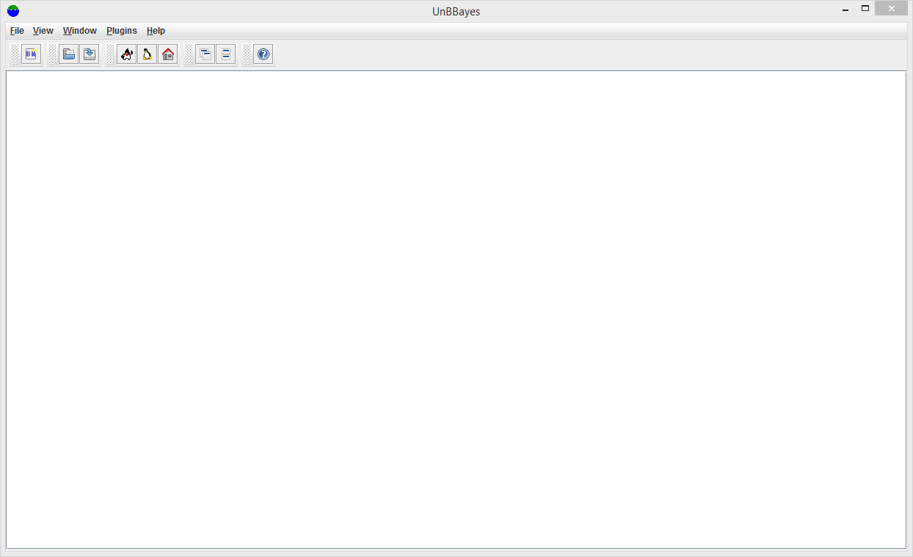

## An Introduction to UnBBayes

UnBBayes is a probabilistic network framework written in Java. It has both a GUI and an API with inference, sampling, learning and evaluation. It supports Bayesian networks, influence diagrams, MSBN, OOBN, HBN, MEBN/PR-OWL, PRM, structure, parameter and incremental learning.

## Features

* Probabilistic Networks:
    * Bayesian Network (BN)
        * Junction Tree
        * Likelihood Weighting
        * Gibbs
    * Influence Diagram (ID)
    * Multiply Sectioned Bayesian Network (MSBN)
    * Hybrid Bayesian Network (HBN)
        * Gaussian Mixture - Propagation under development
    * Object-Oriented Bayesian Network (OOBN)
* FOL Probabilistic Network:
    * Multi-Entity Bayesian Network (MEBN)
    * Probabilistic Ontology Language (PR-OWL)
* Learning Bayesian Network:
    * K2
    * B
    * CBL-A
    * CBL-B
    * Incremental Learning
* Sampling
    * Logic
    * Likelihood Weighting
    * Gibbs
* Classification Performance Evaluation
    * Evaluation using Logic Sampling
    * Evaluation using Likelihood Weighting Sampling

## Installation

1. Go to [https://sourceforge.net/projects/unbbayes/files/latest/download?source=typ_redirect](https://sourceforge.net/projects/unbbayes/files/latest/download?source=typ_redirect) to download zip file
2. Extract file *unbbayes-4.21.18.zip*  to *unbbayes-4.21.18* folder
3. Open *unbbayes-4.21.18* folder, double click to *unbbayes.bat*

*unbbayes-4.21.18* open

## Official Videos

In this section, I add some official videos from unbbayes team. There are overview
### Overview

In this video we are going to show the basic function we have in UnBBayes. This is the first of many tutorials we have been creating to support the demand for documentation on how to use UnBBayes. We hope this will help UnBBayes' user community to grow even more.

<iframe width="560" height="315" src="https://www.youtube.com/embed/FZa1Obn9qI0" frameborder="0" allowfullscreen></iframe>

### Bayesian Network

In this video we are going to show how to create and compile a Bayesian Network (BN) in UnBBayes. This is our second of many video tutorials we have been creating to support the demand for documentation on how to use UnBBayes. We hope this will help UnBBayes' user community to grow even more.

<iframe width="560" height="315" src="https://www.youtube.com/embed/ExlfjBQfvMk" frameborder="0" allowfullscreen></iframe>

### UnBBayes Performance Evaluation for Multi-Sensor Classification Systems

In this video we are going to show how to do a performance evaluation for multi-sensor classification systems in UnBBayes. It has been a while we do not post new videos, but hopefully this third one is just one more of many tutorials we will have available to support the demand for documentation on how to use UnBBayes. We hope this will help UnBBayes' user community to grow even more.

<iframe width="560" height="315" src="https://www.youtube.com/embed/ExlfjBQfvMk" frameborder="0" allowfullscreen></iframe>

### Probabilistic Ontology Modeling Using UnBBayes

In this video we discuss how to model probabilistic ontologies using PR-OWL/MEBN in UnBBayes. This session was a video conference between PhD students from the Institute of Business Administration (http://www.iba.edu.pk) and Rommel Carvalho from George Mason University (http://www.gmu.edu).

<iframe width="560" height="315" src="https://www.youtube.com/embed/e8NabmtbFNc" frameborder="0" allowfullscreen></iframe>

