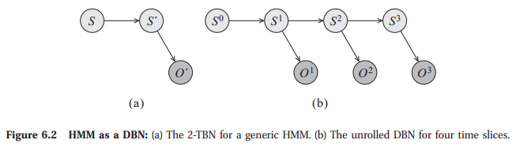

# Template Models for Bayesian Networks

In many cases, we need to model distributions that have a recurring structure. In this module, we describe representations for two such situations. One is temporal scenarios, where we want to model a probabilistic structure that holds constant over time; here, we use Hidden Markov Models, or, more generally, Dynamic Bayesian Networks. The other is aimed at scenarios that involve multiple similar entities, each of whose properties is governed by a similar model; here, we use Plate Models.

## Temporal Models

Our focus in this section is on modeling dynamic settings, where we are interested in reasoning about the state of the world as it evolves over time. We can model such settings in terms of a system state system state, whose value at time t is a snapshot of the relevant attributes (hidden or observed) of the system at time t. We assume that the system state is represented, as usual, as an assignment of values to some set of random variables X . We use X (t) i to represent the instantiation of the variable Xi at time t. Note that Xi itself is no longer a variable that takes a value; rather, it is a template variable template variable. This template is instantiated at dierent points in time t, and each Xi (t) is a variable that takes a value in Val(Xi). For a set of variables X ⊆ X , we use X (t1:t2) (t1 < t2) to denote the set of variables {X (t) : t ∈ [t1,t2]}. As usual, we use the notation x(t:t0) for an
assignment of values to this set of variables.

Each “possible world” in our probability space is now a trajectory: an assignment of values to each variable X (t) i for each relevant time t. Our goal therefore is to represent a joint distribution over such trajectories. Clearly, the space of possible trajectories is a very complex probability space, so representing such a distribution can be very dicult. We therefore make a series of simplifying assumptions that help make this representational problem more tractable.

## Dynamic Bayesian Networks

## Directed Probabilistic Models for Object-Relational Domains

Based on the framework described in the previous section, we now describe template-based representation languages that can encode directed probabilistic models.

### Plate Models

We begin our discussion by presenting the *plate model*, the simplest and best-established of the object-relational frameworks. Although restricted in several important ways, the plate modeling framework is perhaps the approach that has been most commonly used in practice, notably for encoding the assumptions made in various learning tasks. This framework also provides an excellent starting point for describing the key ideas of template-based languages and for motivating some of the extensions that have been pursued in richer languages.

In the plate formalism, object types are called *plates*. The fact that multiple objects in the class share the same set of attributes and same probabilistic model is the basis for the use of the term “plate,” which suggests a stack of identical objects. We begin with some motivating examples and then describe the formal framework.

#### Examples

**Example 1** *The simplest example of a plate model, shown in figure 6.6, describes multiple random variables generated from the same distribution. In this case, we have a set of random variables \( X(d)\ (d ∈ D) \) that all have the same domain Val(X) and are sampled from the same distribution. In a plate representation, we encode the fact that these variables are all generated from the same template by drawing only a single node X(d) and enclosing it in a box denoting that d ranges over D, so that we know that the box represents an entire “stack” of these identically distributed variables. This box plate is called a plate, with the analogy that it represents a stack of identical plates.*

